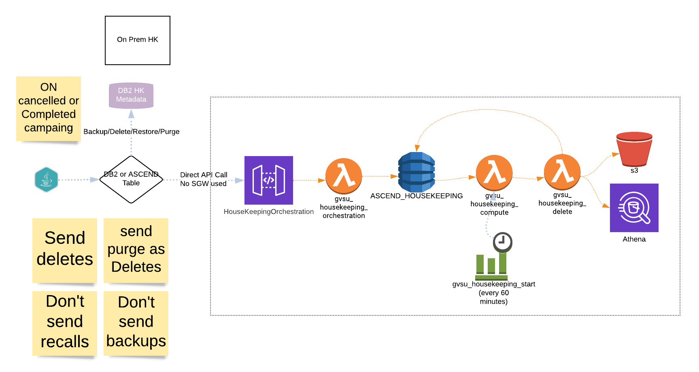

# cloud-housekeeping
Housekeeping help us maintaining the Athena tables and S3 data created by the Campaign execution in AWS Cloud.

## Overview of project
Housekeeping help us maintaining the Athena tables and S3 data created by the Campaign execution in AWS Cloud.

## Features:
* Athena Tables/Views Deletion (including the deletion of S3 data)* 
## Release History
* 0.1.0
    * Beta release

#### Local Setup
In order to build this module the following command has to be used:

* Fork the project in bitbucket using the Bitbucket UI
```
GIT URL: https://github.com/pmanchu5/cloud-housekeeping.git
```
* Clone the repository in your local your git after fork
```
ssh://git@github.com/pmanchu5/cloud-housekeeping.git
```

#### High Level Design

```
https://lucid.app/lucidchart/19da141a-3bb9-4190-9ac7-b2d618a6cbb9/edit?invitationId=inv_e4c3d94e-7377-417e-98b6-c476c0e5a06f
```
DynamoDB Table : ASCEND_HOUSEKEEPING
DataModel:
Column	        Type	Description	                        Sample Value
operation_id	String	Identifier of operation	            "0b8a406f-98fa-11ec-9888-97106dd0f18a"
operation_type	String	Type of operation	                "DELETE"  *Only one currently supported
run_instance	String                                      "20220204112104"
status	        String                                      "REQUESTED", "PROCESSING", "COMPLETED", "FAILED"
table_name	    String                                      "a233140_cc1fcmui2f8_20220204112104_output"
request_ts	    String	Date on which the operation must be performed	"2022-04-13 14:47:59.029"
complete_ts	    String	When operation got completed	    "2022-04-13 15:00:59.029"
data_location	String	Table data location in S3	        "s3://bucket-name/ClientName/AccountNo/ProgramName/RUNID/table/20220204112104_1643752789355_1643756134126_OUTPUT"
requested_on	String	When the row got inserted in the Dynamo	"2022-03-01 00:53:44.030"
table_type	    String	Identifies the type of artifact	    "TABLE","VIEW"
job_database	String                                      "jobsdaily_test", "jobsdaily_uat","jobsdaily"
error_msg	    String	Error message in case of failure
retry_cnt	    Number	Counter of retries after failures	1
start_ts	    String	When the operation started to be processed  "2022-04-13 14:50:00.000"

#### Flow
JAVA application sends the Housekeeping entries using REST API, orchestration lambda injects the REST API calls and puts the HouseKeeping metadata entries in Dynamo DB.
gvsu_housekeeping_compute is invoked every 60 seconds and checks the Dynamo DB Tables if there are any items available for Housekeeping.
gvsu_housekeeping_delete is used called from gvsu_housekeeping_compute to proceed to perform the Housekeeping of S3 and Athena Tables purging.

## Authors
* **Purushothama, Manchu**  [Pmanchu05@gmail.com]
